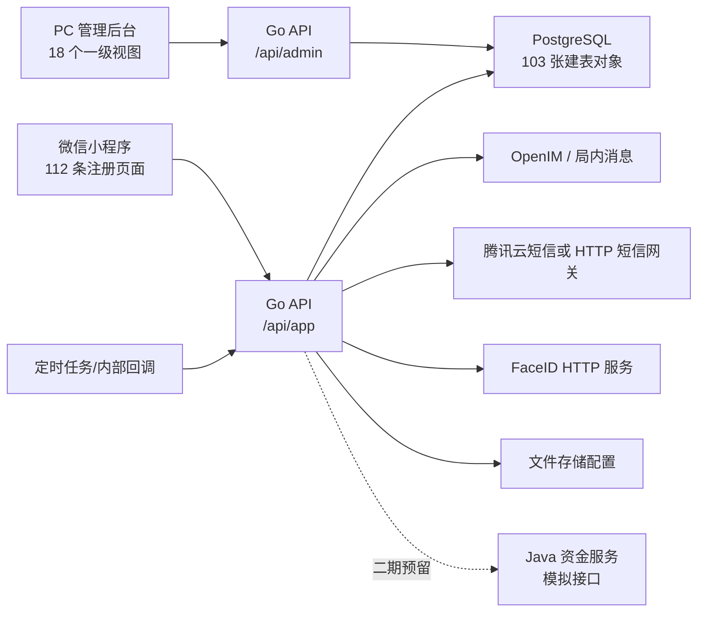

# 真好玩系统交付资料总览

版本日期：2026-07-29  
整理基线：当前工作区代码，包括尚未提交的本机改动  
适用范围：微信小程序、PC 管理后台、Go API、资金预留服务、PostgreSQL 数据库

## 1. 本次交付文件

| 文件 | 用途 |
| --- | --- |
| [数据库设计-当前实现.md](数据库设计-当前实现.md) | 数据库架构、领域模型、核心关系、表分组、风险说明 |
| [数据库表清单-20260729.csv](数据库表清单-20260729.csv) | 103 张表的迁移来源、字段、后续变更和索引统计，Excel 可直接打开 |
| [功能清单-当前实现.md](功能清单-当前实现.md) | 小程序、后台、后端功能，以及已实现、基础实现、预留、缺口状态 |
| [接口清单-当前实现.md](接口清单-当前实现.md) | 接口分层、模块清单、鉴权方式、动态路由、OpenAPI 差异 |
| [接口注册路由清单-20260729.csv](接口注册路由清单-20260729.csv) | 代码实际注册的 366 条服务路由，含处理器、权限和源码位置 |
| [全量UI交付方案-20260729.md](全量UI交付方案-20260729.md) | 向甲方提供全量 UI 的范围、目录、截图规范、交付流程和确认口径 |
| [全量UI页面清单-20260729.md](全量UI页面清单-20260729.md) | 小程序、PC 后台、墨刀原型共 293 个 UI 清单项 |
| [generate-current-system-inventory.py](../scripts/generate-current-system-inventory.py) | 从当前代码重新生成三份 CSV，避免清单长期失真 |

## 2. 当前系统规模

| 项目 | 当前统计 | 说明 |
| --- | ---: | --- |
| 数据库迁移文件 | 74 | `db/migrations/*.sql` |
| 数据库建表对象 | 103 | 不含迁移台账 `schema_migrations`，包含 `schema_migrations_marker` |
| 数据库显式索引 | 92 | 不含主键和表内唯一约束自动产生的索引 |
| 数据库种子文件 | 7 | 管理员权限、测试账号、邀请码、系统配置等 |
| Go API 注册路由 | 351 | 348 条业务注册路由加 3 条健康检查 |
| 资金预留服务路由 | 15 | 含 1 条健康检查；当前为静态或模拟实现 |
| 接口注册总数 | 366 | 详见 CSV；动态前缀并不等于一个最终 URL |
| OpenAPI 操作数 | 352 | App 201，Admin 151 |
| OpenAPI 缺少的静态注册路由 | 30 | 代码已存在，但 OpenAPI 尚未同步 |
| 小程序前端 API 调用 | 145 | 静态检查未发现缺失后端注册路由 |
| 小程序已注册页面 | 112 | `app.json` 主包 14、分包 98 |
| 小程序未注册页面文件 | 8 | 6 个地图子页、支付页、管理中心页 |
| PC 后台一级视图 | 18 | 另有登录页 |
| PC 后台页签/子视图 | 49 | 不含动态抽屉、弹窗和详情状态 |
| 墨刀原型画布 | 105 | 基准尺寸 375×812pt |

## 3. 当前技术架构

## 4. 交付时必须说明的边界

1. 本文档描述的是当前工作区代码，不等同于已经部署到生产环境的版本。交付前应固定 Git 提交号或发布包版本。
2. 真实微信支付、微信分账、退款、对账仍是二期预留；不能把模拟资金接口描述为已上线支付能力。
3. 墨刀归档了 105 个原型画布，但仓库内没有可编辑的 Figma、Sketch、XD、PSD 或 AI 设计源文件。
4. 小程序当前有 112 条注册页面，但“页面存在”不等于“所有数据状态和视觉均已验收”。全量 UI 必须把页面、弹窗、加载、空态、异常态和角色状态分别列出。
5. 数据库多数业务关系由应用层维护，显式外键很少；交付数据库设计时应称为“逻辑关系”，不能宣称数据库已经完整实现引用完整性。
6. 当前工作区有大量未提交改动。对外发包前必须先建立发布基线，避免代码、截图、接口和数据库文档对应不同版本。

## 5. 建议给甲方的交付组合

甲方需要“全量 UI”时，不建议只发送一批截图。建议交付以下五部分：

1. 页面清单：页面编号、页面名称、角色、入口、状态、代码路由、原型画布、截图文件名。
2. 高清截图包：统一设备尺寸、统一数据环境，页面和关键弹窗逐一编号。
3. 可点击原型：提供墨刀只读链接或导出的离线原型；如果要求设计源文件，需由原设计方授权导出。
4. 设计规范与素材：颜色、字体、间距、圆角、图标、图片、空态和组件状态。
5. 差异说明：未开放功能、二期预留、缺少设计源、未注册页面和未完成视觉对齐项。

具体目录和交付步骤见《全量 UI 交付方案》。
